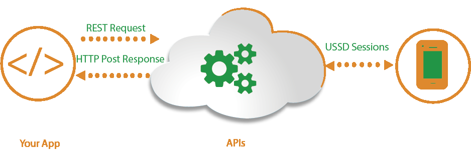

# CROWD SOURCED EPIDEMIC REPORT SYSTEM
> ## USSD BASED *321\*XXX# SOLUTION 

url : [VISIT PROJECT](http://)

This app was developed using the following stack:
> Nodejs , Express for API and Microservices

>VueJS, For frontend

>Firebase client

This project is aimed at building a data driven solution that provides datasets related to any epidemic outbreak in a given geographical region.

